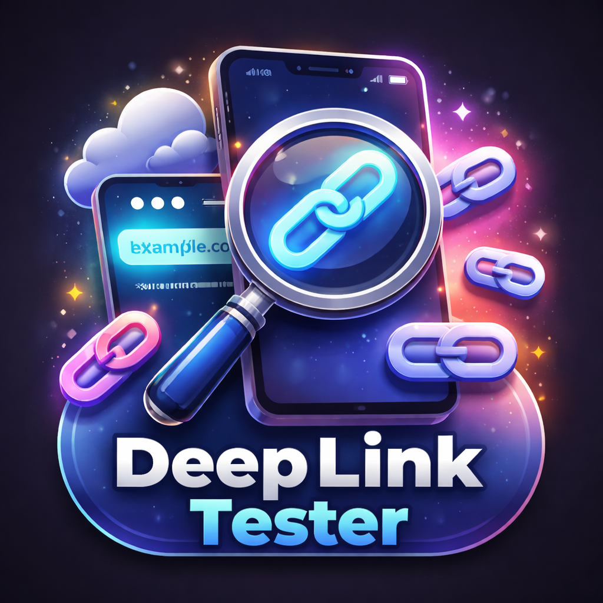

<h1 align="center">DeepLinkTester - tvOS App</h1>

<p align="center">
  
  
  
  
  
  
</p>

---

**DeepLinkTester** is a tvOS application built with **UIKit** to test and validate deep links.  
It allows developers and QA teams to quickly verify deep linking behavior in a controlled environment.

---

## ✨ Features

- 🔗 **Deep Link Testing**: Trigger and validate deep links easily
- 📺 **tvOS Optimized UI**: Designed for Apple TV navigation & focus engine
- ⚡ **Lightweight & Fast**: Minimal setup, quick testing workflow
- 🧪 **QA Friendly**: Useful for debugging and validating app routing

---

## 📦 Requirements

- tvOS **16.6+**
- Xcode **16.4+**
- Swift **5.0**

---

## 🛠️ Installation

1. Clone the repository:
   ```bash
   git clone https://github.com/deepanshubajaj/DeepLinkTester-tvOS-App.git
   ```

2. Open in Xcode:
   ```bash
   open DeepLinkTesterTV.xcodeproj
   ```

3. Build and run on a simulator or device (Scheme: `DeepLinkTesterTV`).

---

## 📱 App Icon:

<p align="center">
  
</p>
<p align="center">
  *The App Icon reflects the DeepLinkTester App Look*
</p>

---

## 🤝 Contributing

Thank you for your interest in contributing to this project!  
I welcome contributions from the community.

- You are free to use, modify, and redistribute this code under the terms of the **Apache-2.0 License**.
- If you'd like to contribute, please **open an issue** or **submit a pull request**.
- All contributions will be reviewed and approved by the author — **[Deepanshu Bajaj](https://github.com/deepanshubajaj?tab=overview&from=2025-03-01&to=2025-03-31)**.

---

## 📌 How to Contribute

To contribute:

1. Fork the repository.

2. Create a new branch:
   ```bash
   git checkout -b feature/your-feature-name
   ```

3. Commit your changes:
   ```bash
   git commit -m 'Add your feature'
   ```

4. Push to the branch:
   ```bash
   git push origin feature/your-feature-name
   ```

5. Open a pull request.

---

## 📃 License:

This project is licensed under the [Apache-2.0 License](./LICENSE).  
You are free to use this project for personal, educational, or commercial purposes — just make sure to provide proper attribution.

> **Clarification:** Commercial use includes, but is not limited to, use in products,  
> services, or activities intended to generate revenue, directly or indirectly.

---

## 📩 Contact:

You can reach out to me [here](https://contact-form-react-sepia.vercel.app/).